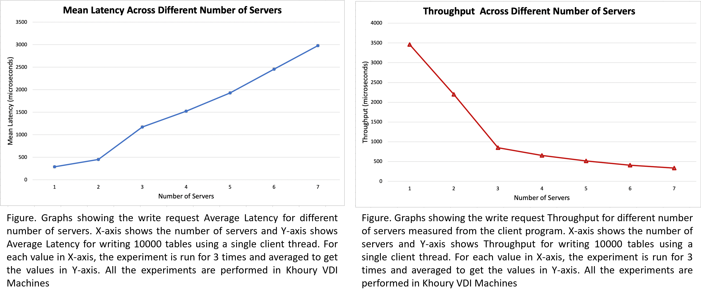

# Project Group 7: Tapestry-based Distributed Data Lake

Grace Fan and Aamod Khatiwada

## Abstract

Data lakes are the source of millions of tables. Due to their massive size, storing them in a single machine is neither feasible nor fault tolerant. Instead, tables in open data lakes should be stored and replicated across multiple storage nodes. In this project, we present a distributed peer-to-peer data lake that stores metadata of the open data tables across multiple nodes using Tapestry protocol.

## Setup

We use a client program to populate tables in the data lake and to read them. This project is written in C++11 and can be compiled using make commands. The required compilers are gcc and g++.

1. Clone the repo in the client and server machine and CD to the repo directory.

2. Open a terminal window and use the following command to compile the server code.
 ```
 	make server
 ```
3. Use the following command to compile the client code.
```
	make client
```
You can also compile both server and client programs at the same time using the following command.
```
	make all
```
If your distributed machines fetch code from the same storage location, you can compile it once. However, if you are using the servers and the client that use code from separate storage locations, you need to compile on every machines.

## Reproducibility

To verify the correctness of implementing Tapestry protocol, we have a client program that writes tables to the data lake first and read them back. Note that, we provide each table with a unique table id and synthetically generated metadata.

### Starting Server programs

On each server, CD to the repo directory, open a terminal and provide the following arguments.
```
	./server [port #] [unique ID] [# peers ] ( repeat for each peer [ID] [IP] [ port #])
```

For example, to run 3 server programs locally (using different ports), open 3 different terminals and provide the following arguments.

1. Server id 3001 on port number 1231:
```	
	./server 1231 3001 2 5001 127.0.0.1 1232 9001 127.0.0.1
```
2. Server id 5001 on port number 1232:
```
	./server 1232 5001 2 3001 127.0.0.1 1231 9001 127.0.0.1 1233
```
3. Server id 9001 on port number 1233:
```
	./server 1233 9001 2 3001 127.0.0.1 1231 5001 127.0.0.1 1232
```
Use the following arguments to run the server programs in 7 Khoury VDI machines.

1. vdi-linux-041.ccs.neu.edu
```
	./server 50001 5231 6 2895 10.200.125.42 50002 1122 10.200.125.43 50003 6655 10.200.125.44 50004 4484 10.200.125.45 50005 5432 10.200.125.46 50006 5244 10.200.125.47 50007 
```
2. vdi-linux-042.ccs.neu.edu
```
	./server 50002 2895 6 5231 10.200.125.41 50001 1122 10.200.125.43 50003 6655 10.200.125.44 50004 4484 10.200.125.45 50005 5432 10.200.125.46 50006 5244 10.200.125.47 50007
```
3. vdi-linux-043.ccs.neu.edu
```
	./server 50003 1122 6 2895 10.200.125.42 50002 5231 10.200.125.41 50001 6655 10.200.125.44 50004 4484 10.200.125.45 50005 5432 10.200.125.46 50006 5244 10.200.125.47 50007 
```
4. vdi-linux-044.ccs.neu.edu
```
	./server 50004 6655 6 2895 10.200.125.42 50002 1122 10.200.125.43 50003 5231 10.200.125.41 50001 4484 10.200.125.45 50005 5432 10.200.125.46 50006 5244 10.200.125.47 50007 
```
5. vdi-linux-045.ccs.neu.edu
```
	./server 50005 4484 6 2895 10.200.125.42 50002 1122 10.200.125.43 50003 5231 10.200.125.41 50001 6655 10.200.125.44 50004 5432 10.200.125.46 50006 5244 10.200.125.47 50007 
```
6. vdi-linux-046.ccs.neu.edu
```
	./server 50006 5432 6 2895 10.200.125.42 50002 1122 10.200.125.43 50003 5231 10.200.125.41 50001 6655 10.200.125.44 50004 4484 10.200.125.45 50005 5244 10.200.125.47 50007 
```
7. vdi-linux-047.ccs.neu.edu
```
	./server 50007 5244 6 2895 10.200.125.42 50002 1122 10.200.125.43 50003 5231 10.200.125.41 50001 6655 10.200.125.44 50004 4484 10.200.125.45 50005 5432 10.200.125.46 50006 
```

The current design of prefix routing can handle up to 10000 peers (servers). Recall that, each peer in Tapestry protocol needs to know at most logn out of n peers in the network. However for convenience and understandability, we provide all 6 peer information to each peer from the command line in the above example. Still our protocol stores only a subset of these peers (need to know nodes) and discard others. Even if we create a network of all 10000 peers, the routing table of each peer has only 40 slots to store other peer information. Therefore, we never store all peer information although it is provided from the command line.

### Starting client program

We use multithreading to write the table metadata to the data lake where, the client program connects to a manually selected nearest data lake server. Each client thread writes a specific number of tables to the data lake.

#### Sending table write request

Recall that we use client program to write tables to the distributed servers. For experiments, we create metadata for each table synthetically which can be easily replaced by the actual metadata in the real implementation. 

CD to the repo directory and start the client program by providing the following arguments on its terminal.

```
./client [nearest_server_ip] [nearest_server_port] [num_of_threads] [tables_per_thread] [request_type]
```
We use request_type = 1 for write request.

For example, to run the client program locally with servers having ids 3001, 5001 and 9001 started using the instructions above, we use the following command for writing 10000 tables using 5 client threads (2000 per thread) and considering server 5001 as the nearest server to the client.
```
./client 127.0.0.1 1233 5 2000 1
```
Use the following arguments to run the client program in any Khoury VDI machine (except the machines used for server). 
```
./client 10.200.125.45 50005 10 2000 1
```
The client considers **vdi-linux-045.ccs.neu.edu** as the nearest server and writes 20000 tables using 10 threads (2000 per thread).

#### Reading specific table using its ID

We again use client program to read tables from the distributed data lake. No matter on which server the table is stored, the client can read it by connecting to a (manually selected) nearest server.

CD to the repo directory and start the client program by providing the following arguments on its terminal.

```
./client [nearest_server_ip] [nearest_server_port] [num_of_threads] [table_id] [request_type]
```
We use num_of_threads = 1 and request_type = 2 for reading a single table. Using more than 1 thread reads same table for multiple times.

For example, to run the client program locally with servers having ids 3001, 5001 and 9001 started using the instructions above, we use the following command for reading the table with id 4566 and considering server 3001 as the nearest server to the client.
```
./client 127.0.0.1 1231 1 4566 2
```
Use the following arguments to run the client program in any Khoury VDI machine (except the machines used as server). 
```
./client 10.200.125.41 50001 1 4566 2
```
The client considers **vdi-linux-041.ccs.neu.edu** as the nearest server and reads table with id 4566.

#### Reading first K tables

We again use client program to read the first k tables (having id from 0 to k-1) from the distributed data lake. No matter on which server each table is stored, the client can read it by connecting to a (manually selected) nearest server.

CD to the repo directory and start the client program by providing the following arguments on its terminal.

```
./client [nearest_server_ip] [nearest_server_port] [num_of_threads] [k] [request_type]
```
We use num_of_threads = 1 and request_type = 3 for reading all tables. Using more than 1 thread reads same table for multiple times and makes it difficult to understand the results.

For example, to run the client program locally with servers having ids 3001, 5001 and 9001 started using the instructions above, we use the following command for reading first 6000 tables (id 0 to 5999) and considering server 3001 as the nearest server to the client.
```
./client 127.0.0.1 1231 1 6000 3
```
Use the following arguments to run the client program in any Khoury VDI machine (except the machines used as server). 
```
./client 10.200.125.41 50001 1 6000 3
```
The client considers **vdi-linux-041.ccs.neu.edu** as the nearest server and reads table with id 4566.

## Statistics

Apart from correctness experiment to evaluate the system, we also report Average Write Table Latency and Write Table Throughput for the following configuration. The experiments were run on Khoury VDI machines.

- 1 client thread and varying number of servers (writing 10000 tables).
	- X-axis: number of servers (1, 2, 3, 4, 5, 6, 7)
	- Y-axis: Average Latency

- 1 client thread and varying number of servers (writing 10000 tables).
	- X-axis: number of servers (1, 2, 3, 4, 5, 6, 7)
	- Y-axis: Throughput

The latency and througput graphs are obtained as shown in figures below. In summary, the latency increases rapidly for the increase in the number of servers whereas the througput is high for 1 server but decreases sharply when we increase the number of servers.
